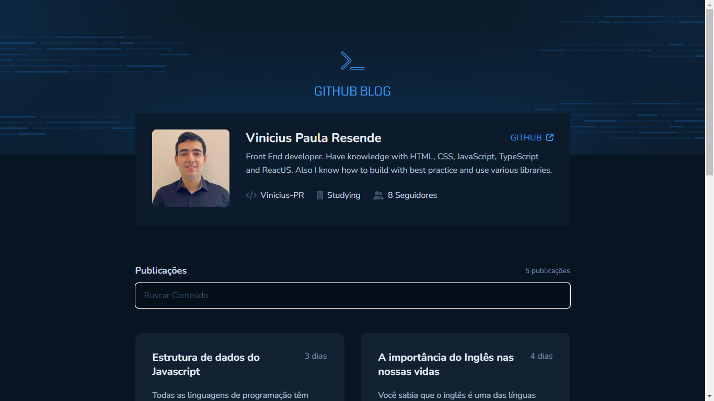

# Challenge 03 - Ignite 2022 - React JS - GitHub Blog

This challenge is a blog, using the issue of a repository as a post of the blog. The app consume GitHub API to get the data.

## Languagues used
* HTML
* CSS (Styled Components)
* javaScript
* TypeScript

## Explanation

The Application uses the issues of a repository as a blog post. To achieve it, was used React through Vite with typescript, Axios, react-hook-form, react-router and others libraries.
The App have to:

* Show my profile data: Image, follower quantity, name, bio and others info from GitHub API
* List all issues and show at home page with a small summary
* Put an input to search an issue
* Create a page to show the issue

The application is small but I had to remember important concepts:

* Fetch/Axios
* Routing and React Router Dom
* Forms

## Pages
### Home Page

The Home Page is where all posts are listed.

### Post Page

This page shows the entire post.

## Mobile version

This application has a mobile version. It is 100% responsive.

## How can I use it?

### First
Check if you have the node and npm (comes with node) installed in your machine. To check, you must go to your terminal or command prompt and type:
> node -v
> npm -v

If shows the version, you are good to go. If not, go to https://nodejs.org/en/ and install the LTS version (it will install both node and npm).

### Second

If you don't have an IDE, install one of you preference. In my case, I used Visual Studio Code.

### Third

You clone the project. Use the commande line on your folder:
 > git clone https://github.com/Vinicius-PR/Challenge-03-Ignite-2022-GitHub-Blog.git
 
 ### Forth
 
Open the folder using your IDE. Then, go to the terminal of your IDE and type the following command to install the dependencies: (or can go to the folder application using normal terminal and type the same command)
 > npm install
 
 ### Finally
 
Type the next command to see the result and click on the link that will appear on the terminal:
 > npm run dev

**Note:** If you want to use your repository, you have to change the request address at **indes.tsx** that are in the Home and Post folder.